# Claude Manager

A self-hosted Docker container management UI for [Claude Code](https://docs.anthropic.com/en/docs/claude-code) workspaces with **per-container network policy enforcement** and a **pluggable LLM backend**. Claude Manager runs as a Docker container alongside your Claude Code instances, providing a web dashboard to create, monitor, and access isolated workspace containers through the Docker Engine API.

This repository contains everything needed to run the stack — the manager UI, the workspace image, a squid forward proxy, a LiteLLM router, and an Ollama runtime for local inference.

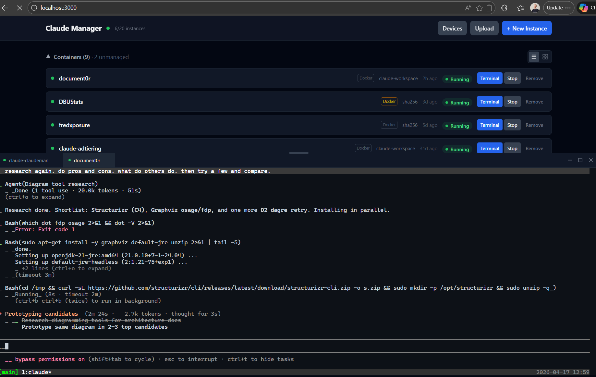

> **v2 is the active version** (port 3002, `docker-compose.v2.yml`). v1 still runs on port 3000 (`docker-compose.yml`) as legacy. This README documents v2.

**[Overview](#overview)** · **[Architecture](#architecture)** · **[Network Policy](#network-policy)** · **[LLM Backends](#llm-backends)** · **[Data & Auth](#data--auth)** · **[Terminal](#terminal)** · **[Setup](#setup)**

---

## Overview

### At a Glance

Everything Claude Manager v2 gives the operator, on one page.

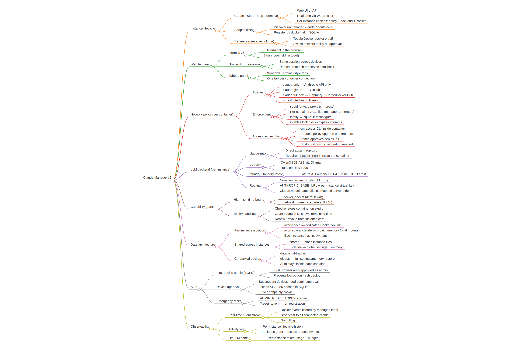

### Features

**Instance management**
- Create, start, stop, recreate, and remove Claude Code containers from a web UI
- Per-instance choice of network policy and LLM backend at creation time
- Automatic discovery and adoption of existing `claude-*` containers
- Real-time updates via Docker event stream (no polling)

**Network policy enforcement**
- Four shipped policies — `claude-only`, `claude-github`, `claude-full-dev`, `unrestricted`
- Enforced by a sidecar squid forward proxy (`cm-proxy`) with per-container ACLs
- Plus an in-container iptables lock — defence in depth, no proxy bypass
- Access request flow — agents request more access via `cm-access`, admin approves/denies in the UI

**Pluggable LLM backend**
- `claude-max` — direct `api.anthropic.com` (your Claude Max subscription)
- `local-llm` — Qwen3 30B-A3B on a local NVIDIA GPU via Ollama
- `foundry` / `foundry-latest` — Azure AI Foundry GPT-4.1-mini / GPT Latest
- All non-`claude-max` backends go through LiteLLM, which speaks Claude's API on the front and routes to Ollama / Azure on the back

**Shared web terminal**
- Full terminal in the browser via xterm.js v6
- tmux sessions shared across devices — desktop + mobile see the same shell
- Tabbed panel with Windows Terminal-style tab management; reconnect without losing state

**Capability grants**
- Time-bound (default 24 h) grants for `docker_socket` and `network_unrestricted`
- Expired grants auto-stop the container; UI offers renew or recreate-without

**Data architecture**
- Per-instance project memory isolated at `/workspace/.claude`
- Shared global Claude config (CLAUDE.md + settings + global memories)
- Per-instance auth — each instance runs its own `claude login` (Max) and `gh auth login`
- Shared storage at `/shared` for cross-instance files and uploads
- Everything in `data/` — git-tracked for backup

### How It Differs from Native Claude Code

Claude Code (2.1.112) ships with worktrees, auto memory, a reference DevContainer config, and session resume. Those solve isolation for **single-user CLI workflows**. Claude Manager v2 fills a different niche:

| Need | Native Claude Code | Claude Manager v2 |
|---|---|---|
| Multi-container orchestration | None | Yes, from one dashboard |
| Full container isolation | Worktrees (same filesystem) | Separate FS, auth, memory per instance |
| Per-container network policy | None | squid proxy + iptables lock, four shipped policies |
| Pluggable LLM backend | Claude only | Claude / local Qwen3 / Azure AI Foundry per instance |
| Web + mobile access | CLI/IDE only | Shared tmux terminals in browser |
| Cross-instance visibility | None | Single dashboard, live state |
| Custom workspace images | DevContainer reference | Versioned, reproducible |

Native worktrees and auto memory are complementary — they work *inside* each container instance.

---

## Architecture

Six containers, one bridge network. The manager creates and tears down workspace containers as siblings via the Docker socket.

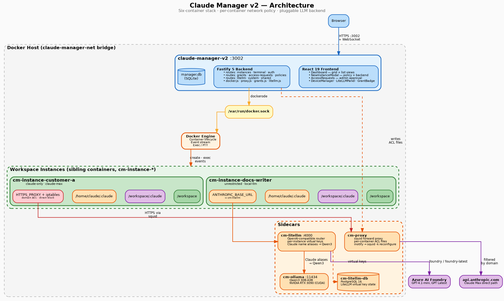

**The stack:**

| Container | Source | Role |
|---|---|---|
| `claude-manager-v2` | `v2/Dockerfile` | Fastify 5 backend + React 19 frontend |
| `cm-proxy` | `proxy/Dockerfile` | squid forward proxy — per-container network ACLs |
| `cm-litellm` | `litellm/Dockerfile` | LiteLLM proxy — Claude API → Ollama / Azure |
| `cm-ollama` | `ollama/ollama` | Qwen3 30B-A3B on NVIDIA GPU |
| `cm-litellm-db` | `postgres:16` | PostgreSQL for LiteLLM virtual-key state |
| `cm-instance-*` | `workspace/Dockerfile` | Per-project workspace containers |

**Key design decisions:**

- **Docker as source of truth** — container state from the Docker API; SQLite stores supplemental metadata, devices, grants, access requests
- **Sibling containers, not nested** — manager talks to `dockerode` over the host socket
- **Cognitive isolation** — per-instance `/workspace` volume + `/workspace/.claude` memory + per-instance auth
- **Defence in depth on network** — squid filters by domain, iptables blocks bypass attempts at the kernel level
- **Pluggable inference** — non-Claude backends speak Claude's API via LiteLLM, so Claude Code works unchanged
- **Git-backed data** — config and memory live in `data/` inside the repo; push to back up, clone to restore

### Deployment Topology

Physical layout on a host — manager + four sidecars + N workspace instances.

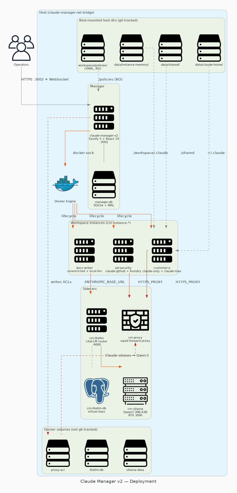

### Instance Lifecycle & Real-Time Updates

REST API for instance management with WebSocket-powered live updates from the Docker event stream.

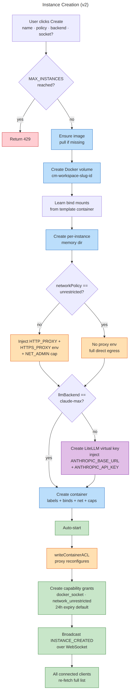

**Creating an instance.** Pick a network policy and LLM backend in the modal. The manager applies the proxy env, mints a LiteLLM virtual key (if needed), writes the per-container ACL, and registers any high-risk capability grants.

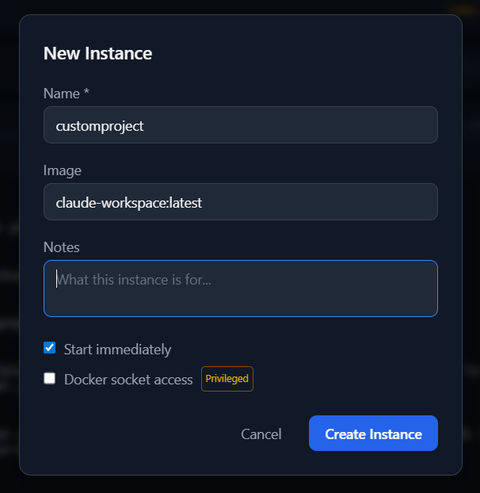

**Adopting existing containers.** The manager queries Docker for `claude-*` containers without the `claude-manager.managed=true` label — they appear as "unmanaged" in the grid and can be adopted in place.

---

## Network Policy

Each container runs under one of four policies, enforced by `cm-proxy` (squid) plus an in-container iptables lock.

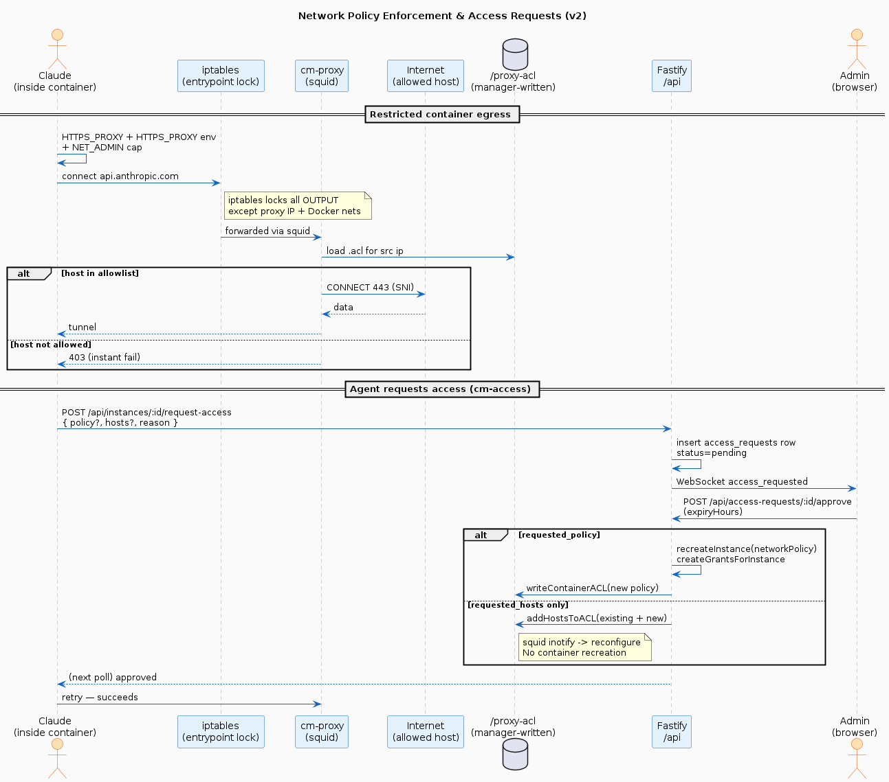

| Policy | Hosts |
|---|---|
| `claude-only` | Anthropic API + statsig + sentry |
| `claude-github` | + GitHub (web / API / objects / raw / gist / ssh) |
| `claude-full-dev` | + npm, yarn, PyPI, files.pythonhosted.org, Cargo, Docker Hub |
| `unrestricted` | No filtering — covered by a 24 h capability grant |

For restricted policies, the manager injects `HTTPS_PROXY`/`HTTP_PROXY` env into the container *and* runs an entrypoint script that locks outbound traffic with iptables. The proxy reads per-container ACL files generated by the manager and reloads via inotify within ~1 second of any change.

**Agents can request more access.** Inside a restricted container:

```bash
cm-access --list                                    # show policies
cm-access --request --policy claude-github --reason "Need to clone"
cm-access --request --hosts "api.example.com" --reason "Fetch data"
cm-access --poll
```

Admins approve / deny in the dashboard. Policy upgrades recreate the container preserving the volume; extra hosts update the ACL in place without restart.

---

## LLM Backends

Each instance picks one LLM backend at creation time.

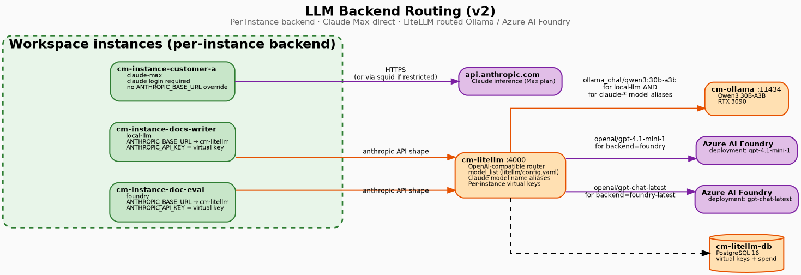

| Backend | Routing |
|---|---|
| `claude-max` | Direct `api.anthropic.com` (`claude login` inside the container) |
| `local-llm` | Qwen3 30B-A3B via Ollama → LiteLLM |
| `foundry` | Azure AI Foundry `gpt-4.1-mini-1` via LiteLLM |
| `foundry-latest` | Azure AI Foundry `gpt-chat-latest` via LiteLLM |

For any backend other than `claude-max`, the manager mints a **per-instance LiteLLM virtual key** with a budget (default $20) and injects `ANTHROPIC_BASE_URL=http://cm-litellm:4000` + `ANTHROPIC_API_KEY=<virtual-key>` so Claude Code speaks Claude's protocol to LiteLLM. LiteLLM's `model_list` aliases Claude model names (`claude-opus-4-7`, `claude-sonnet-4-6`, …) to the chosen backend.

The LiteLLM panel on each instance card shows usage and budget.

---

## Data & Auth

### Data Architecture

Per-instance isolation with shared global config. Git-tracked for backup — push to restore.

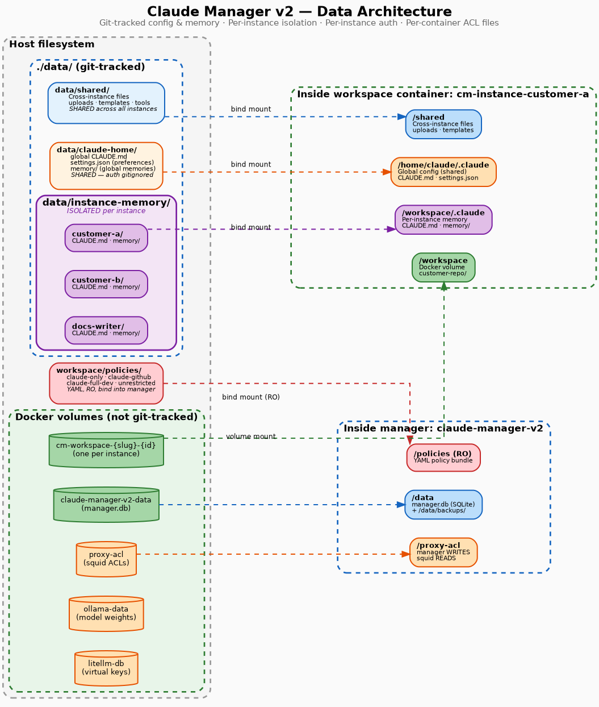

```
claude-manager/
├── data/                          ← git-tracked, your backup
│   ├── shared/                    ← /shared in all instances
│   ├── claude-home/               ← /home/claude/.claude (global config + memory, auth gitignored)
│   │   ├── settings.json
│   │   ├── CLAUDE.md              ← global agent instructions (incl. cm-access workflow)
│   │   └── memory/                ← global memories
│   └── instance-memory/           ← per-instance project memory
│       ├── customer-a/            ← /workspace/.claude in customer-a instance
│       └── ...
├── workspace/
│   └── policies/                  ← YAML — bind-mounted into manager as /policies (RO)
├── v2/                            ← active manager (backend + frontend)
├── proxy/ · litellm/              ← sidecar images
└── workspace/                     ← claude-workspace image source
```

**Isolation model:**
- Each instance has its own workspace volume, project memory, and auth — no cross-contamination
- Global Claude settings, CLAUDE.md, and global memories shared via `data/claude-home/`
- Auth is per-instance: each instance runs its own `claude login` (Max) and `gh auth login`
- `/shared` is explicitly shared for cross-instance files, templates, tools

**Backup:** Push to GitHub. If your machine dies, clone the repo and `docker compose -f docker-compose.v2.yml up` — settings and memory are restored. Each instance re-auths on first use.

### Manager Database Schema

`manager.db` (SQLite) holds supplemental metadata: instance metadata, device auth, capability grants, access requests, LiteLLM keys, activity history.

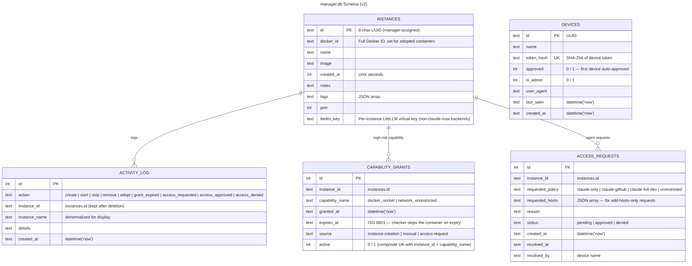

### Device Authentication

First device auto-approved as admin (TOFU). Subsequent devices require admin approval before accessing the API.

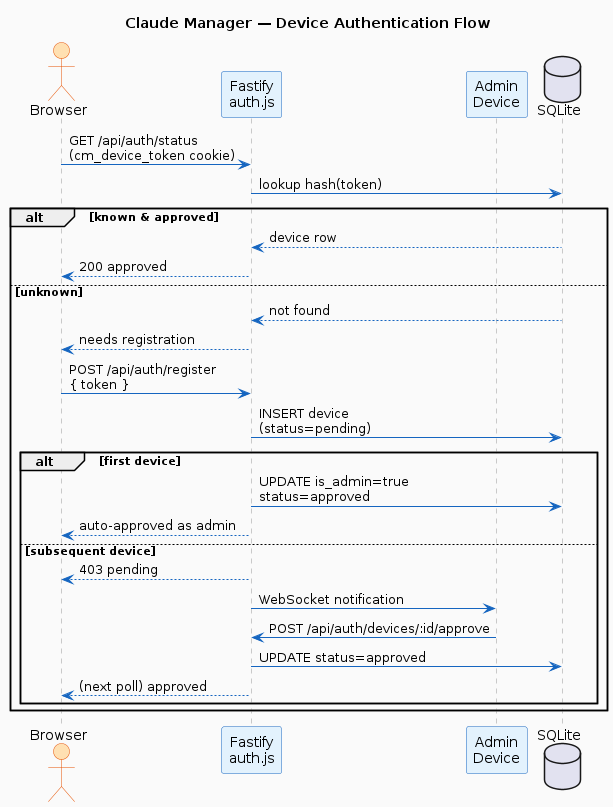

---

## Terminal

Connect to the same tmux session from multiple devices — desktop and mobile see identical output. Sessions persist across disconnects; reconnecting picks up exactly where you left off.

**Session lifecycle (state machine):**

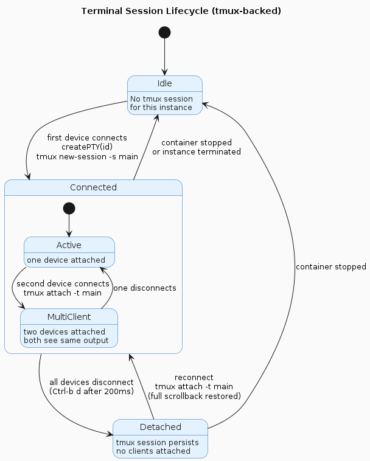

**WebSocket protocol (what happens on the wire):**

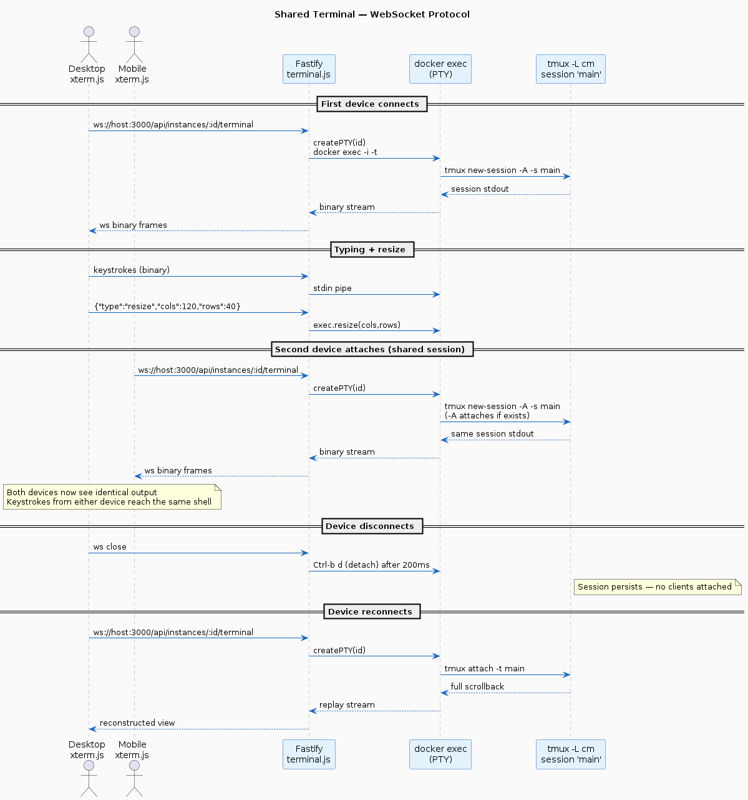

---

## Setup

### Prerequisites

- Docker Engine 20.10+ with Compose v2 and socket at `/var/run/docker.sock`
- For the `local-llm` backend: NVIDIA GPU + [NVIDIA Container Toolkit](https://docs.nvidia.com/datacenter/cloud-native/container-toolkit/) (Qwen3 30B-A3B needs ~24 GB VRAM)
- For `foundry*`: Azure AI Foundry API keys

### Quick Start

```bash
git clone https://github.com/FrederikLeed/claude-manager-public.git && cd claude-manager
cp .env.example .env                                       # set absolute host paths + LiteLLM keys
docker compose -f docker-compose.v2.yml --profile build-only build
docker compose -f docker-compose.v2.yml up -d
```

Open [http://localhost:3002](http://localhost:3002) — the first browser to load it becomes the admin device. See [`.env.example`](.env.example) for all options and [docs/deployment.md](docs/deployment.md) for the full deployment guide.

### Local Development

```bash
npm install
npm run dev          # Fastify on :3001, Vite on :5173 with API proxy (v1)
# v2 frontend lives under v2/, build via Docker image
npm run build
```

### Docker Build

```bash
docker compose -f docker-compose.v2.yml --profile build-only build   # all three buildable images
docker compose -f docker-compose.v2.yml up -d                        # start the stack
```

### Tech Stack

| Layer | Technology |
|---|---|
| Runtime | Node.js 22 |
| Backend | Fastify 5, dockerode, better-sqlite3 |
| Frontend | React 19, Vite, Tailwind CSS 3 |
| Terminal | xterm.js v6 (@xterm/xterm), tmux |
| Workspace | Ubuntu 24.04, Node.js 22, Claude Code, gh CLI, cm-access |
| Network | squid forward proxy + iptables lock |
| LLM stack | LiteLLM proxy + Ollama (Qwen3) + Azure AI Foundry |
| Deployment | Docker multi-stage build, Docker Compose v2 |

### Repository Layout

- `v2/` — active manager backend (Fastify) + frontend (React)
- `proxy/` — `cm-proxy` image (squid + inotify watcher)
- `litellm/` — `cm-litellm` image (LiteLLM + `config.yaml`)
- `workspace/` — workspace Docker image source (Ubuntu 24.04 + Claude Code + `cm-access`)
- `workspace/policies/` — YAML policies, bind-mounted into the manager
- `data/` — runtime config, global memory, per-instance memory (git-tracked)
- `docs/diagrams/` — source + rendered PNGs
- `tests/` + `v2/tests/` — integration test suites (Docker-backed)
- `server/` + `src/` — legacy v1 (port 3000)

<details>
<summary><b>Diagram tooling</b> — every diagram source + render command</summary>

Every diagram is generated from a plain-text source file. Edit the source, re-render, commit both.

| Diagram | Source | Tool | Render |
|---|---|---|---|
| Capabilities | `capabilities.md` | markmap | `markmap capabilities.md --offline --no-open --no-toolbar -o capabilities.html` (PNG via headless screenshot) |
| Architecture | `architecture.dot` | Graphviz | `dot -Tpng architecture.dot -o architecture.png` |
| Deployment | `deployment.py` | mingrammer | `python3 deployment.py` |
| Data architecture | `data-architecture.dot` | Graphviz | `dot -Tpng data-architecture.dot -o data-architecture.png` |
| Schema | `schema.mmd` | Mermaid | `mmdc -i schema.mmd -o schema.png -w 1200 --scale 2` |
| Request flow | `request-flow.mmd` | Mermaid | `mmdc -i request-flow.mmd -o request-flow.png -w 1000 --scale 2` |
| Auth flow | `auth-flow.puml` | PlantUML | `java -jar plantuml.jar -tpng auth-flow.puml` |
| Network policy | `network-policy.puml` | PlantUML | `java -jar plantuml.jar -tpng network-policy.puml` |
| Terminal state | `terminal-state.puml` | PlantUML | `java -jar plantuml.jar -tpng terminal-state.puml` |
| Terminal protocol | `terminal-protocol.puml` | PlantUML | `java -jar plantuml.jar -tpng terminal-protocol.puml` |
| LLM routing | `llm-routing.dot` | Graphviz | `dot -Tpng llm-routing.dot -o llm-routing.png` |

Old `.drawio` sources are archived in `docs/diagrams/archive/`.
</details>

### Roadmap

Phase 1 (instance management), Phase 2 (observability, shared terminals), and the network-policy work originally planned as Phase 3.5 are all shipped. See [docs/roadmap.md](docs/roadmap.md) and [GitHub issues](https://github.com/FrederikLeed/claude-manager-public/issues).

---

## License

[ISC](LICENSE)
