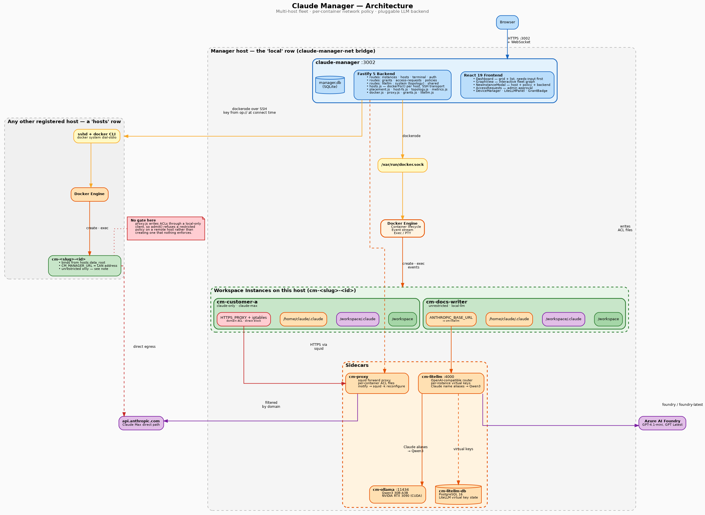
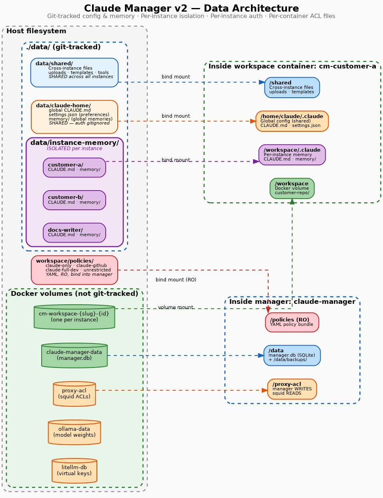
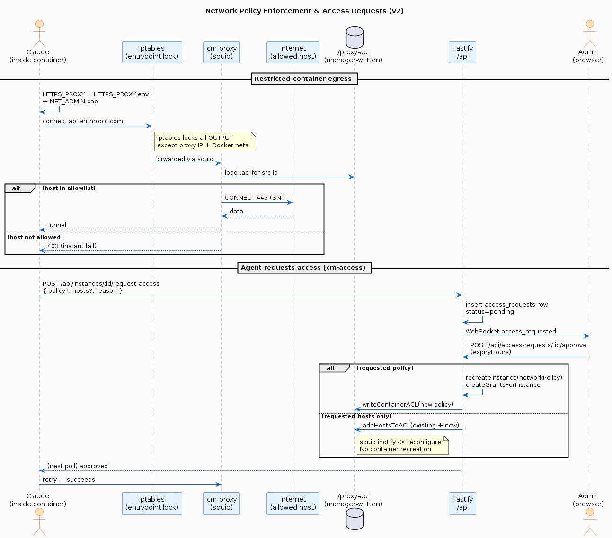
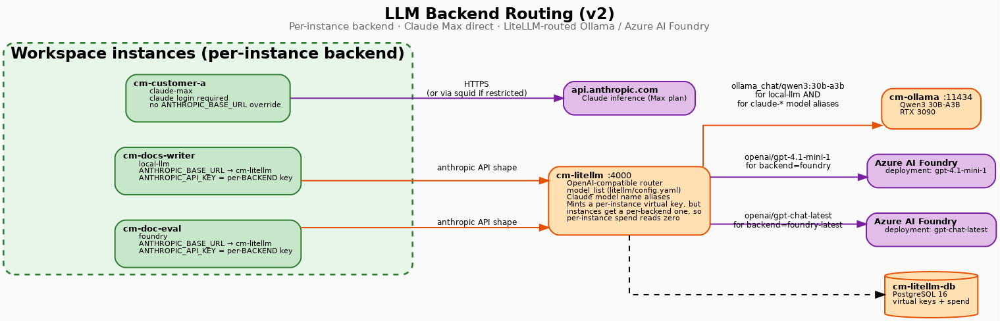
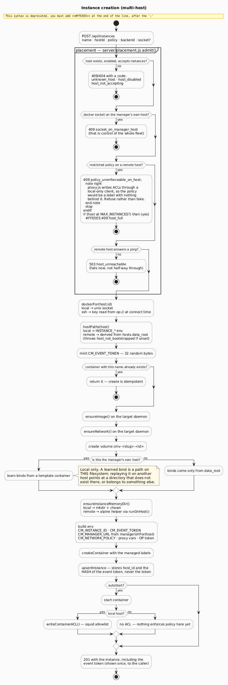
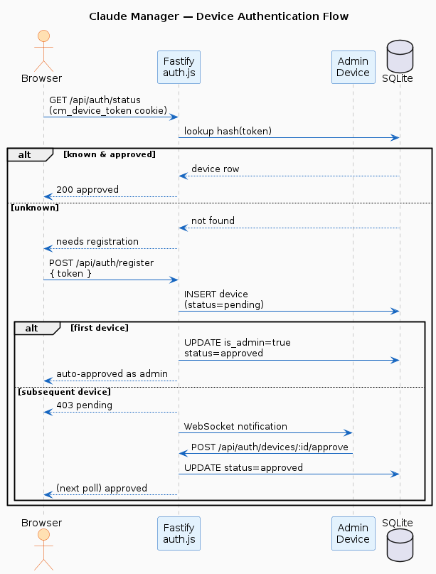
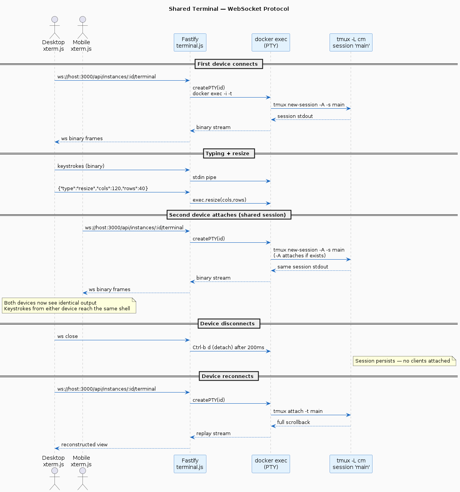
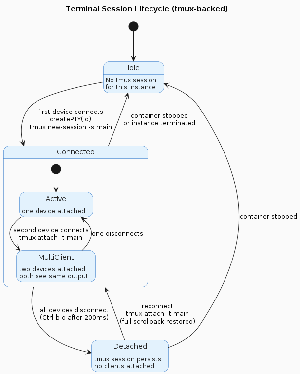
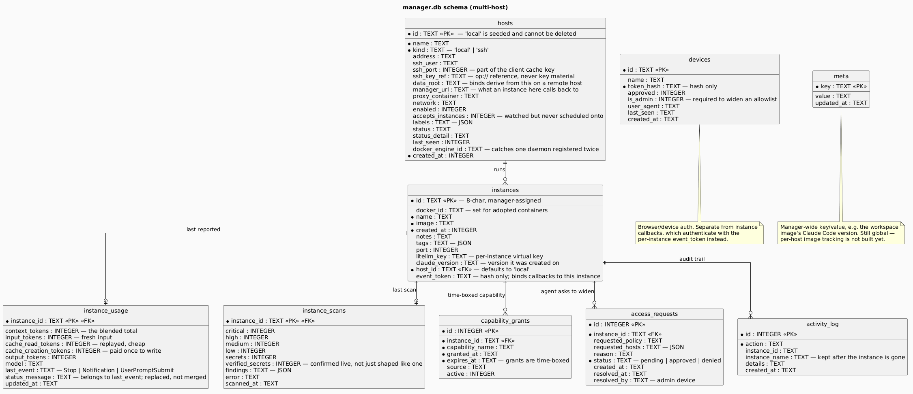

# Claude Manager — Architecture

A self-hosted web UI that runs as a Docker container and manages Claude Code
workspace containers **across a fleet of hosts**, with per-container
**network policy enforcement** and a **pluggable LLM backend** per
instance. For the design intent and current status, see
[brief.md](../brief.md); for day-to-day usage, see
[operations.md](operations.md); for the fleet design and its limits, see
[multi-host.md](multi-host.md) and [fleet-graph.md](fleet-graph.md).

All diagrams below are generated from text sources in `docs/diagrams/`.
Edit the source, re-render, commit both. The render commands live in
the README under "Diagram tooling".

---

## 1. The stack



Six long-running services on the manager's own host, one bridge network
(`claude-manager-net`), plus the instance containers — which may live on this
host or on any other registered one:

| Container             | Image source           | Purpose                                                       |
|-----------------------|------------------------|---------------------------------------------------------------|
| `claude-manager`   | `Dockerfile`        | Fastify 5 backend + React 19 frontend, manages Docker via socket |
| `cm-proxy`            | `proxy/Dockerfile`     | squid forward proxy — enforces per-container network ACLs     |
| `cm-litellm`          | `litellm/Dockerfile`   | LiteLLM proxy — routes Claude Code requests to Ollama / Azure |
| `cm-ollama`           | `ollama/ollama` (NVIDIA) | Local inference — Qwen3 30B-A3B on the host GPU             |
| `cm-litellm-db`       | `postgres:16-alpine`   | PostgreSQL for LiteLLM virtual-key state                      |
| `cm-<slug>-<id>`      | `claude-workspace:latest` (`workspace/Dockerfile`) | Per-project Claude Code workspace containers |

The manager creates and tears down instance containers with `dockerode`, but
**which daemon it talks to depends on the instance's host**. `dockerFor(hostId)`
in `server/hosts.js` returns either the mounted-socket client for the seeded
`local` row — the standard Docker-out-of-Docker sibling pattern — or a dockerode
SSH client for a remote host, whose private key is read from a 1Password
`op://` reference at connect time and never stored. Clients are cached and
invalidated by `signatureOf(host)`, which covers kind, address, user, **port**
and key reference.

The manager still runs no Docker daemon of its own.

### 1.1 Hosts and transport

Every host the manager knows about is a row in `hosts`. The row `local` is
seeded, means "the daemon whose socket is mounted", and cannot be deleted.

| Column | Why it exists |
|---|---|
| `kind` | `local` or `ssh` — picks the transport |
| `ssh_key_ref` | an `op://` reference; key material never reaches the database or a backup |
| `data_root` | where this host keeps `shared/`, `claude-home/` and `instance-memory/` |
| `manager_url` | what an instance here calls back to; for a remote host that is a LAN URL, so the callback leaves the Docker network |
| `accepts_instances` | watched, but never scheduled onto — the production-host case |
| `docker_engine_id` | learned on ping, so one daemon cannot be registered twice under two names |

`pingHost()` records the daemon's reported name and engine id. Registering the
same engine a second time is refused rather than silently double-counting it.

**Placement.** `admit()` in `server/placement.js` is the single gate every
creation passes through, and it refuses with a machine-readable `code` the API
hands straight back:

| Code | Status | Meaning |
|---|---|---|
| `unknown_host` | 404 | no such host |
| `host_disabled` | 409 | registered but switched off |
| `host_not_accepting` | 409 | watched, never scheduled onto |
| `socket_on_manager_host` | 409 | Docker socket on the manager's own host is control of the whole fleet |
| `policy_unenforceable_on_host` | 409 | a restricted policy on a remote host — see §3 |
| `host_full` | 409 | at `MAX_INSTANCES` |
| `host_unreachable` | 503 | fails now rather than half-way through create |

**Paths.** `hostPaths(host)` in `server/host-fs.js` returns the `INSTANCE_*`
environment paths for `local` and derives them from `data_root` for anything
else, throwing `host_not_bootstrapped` when it is unset. Directories a remote
host needs are created by running a throwaway `alpine` container **on that
host** (`runOnHost()`), because the manager cannot `mkdir` on a filesystem it
has not mounted.

**What is still local-only.** `proxy.js`, `proxy-log.js`, `health.js`,
`idle-stop.js`, `security-scan.js`, `connectivity-check.js` and
`workspace-image.js` each build their own client against the mounted socket.
Instances on a remote host are therefore created and driven correctly, but are
not ACL-enforced, health-checked, idle-stopped or scanned. This is the honest
current boundary, not an oversight — and it is why `admit()` refuses a
restricted policy off-host.

---

## 2. Data architecture



```
claude-manager/
├── data/                       git-tracked — your backup
│   ├── shared/                 → /shared in every instance
│   ├── claude-home/            → /home/claude/.claude in every instance
│   │   ├── CLAUDE.md           global agent instructions (incl. cm-access workflow)
│   │   ├── settings.json       global Claude preferences
│   │   └── memory/             global memories
│   └── instance-memory/        per-instance project memory
│       └── <slug>/             → /workspace/.claude in that instance
├── workspace/
│   └── policies/               network policies — bind-mounted into manager as /policies (RO)
├── proxy-acl (Docker volume)   manager writes, cm-proxy reads (inotify reload)
└── claude-manager-data (Docker volume)   /data/manager.db (+ /data/backups/)
```

**Isolation model:**

- Per-instance: `/workspace` (Docker volume `cmv-{slug}-{id}`),
  `/workspace/.claude` (per-slug bind), and **all auth state inside the
  container**.
- Shared: `/home/claude/.claude` (global config + memory + agent
  instructions) and `/shared` (utility files).

Push `data/` to GitHub, clone on a new host, `docker compose -f
docker-compose.yml up` — settings and memory are restored. Each
instance re-authenticates (`claude login` for `claude-max`, `gh auth
login`) on first use.

---

## 3. Network policy enforcement

Each workspace container runs under one of four policies:

| Policy             | Hosts allowed (see `workspace/policies/*.yaml`)                 |
|--------------------|-----------------------------------------------------------------|
| `claude-only`      | `api.anthropic.com`, `platform.claude.com`, `statsig.anthropic.com`, `sentry.io` |
| `claude-github`    | + GitHub (api / web / objects / raw / gist / ssh)               |
| `claude-full-dev`  | + npm, yarn, PyPI, Cargo, Docker Hub                            |
| `unrestricted`     | No filtering (covered by a 24 h capability grant)               |

Every restricted policy also allowlists the hosts in
`shared/constants.js REQUIRED_CLAUDE_HOSTS`, and `lintPolicies()` asserts that
at startup — a policy that would lock Claude Code out of its own control plane
fails the boot rather than the user's next turn.

### Defence in depth

> **On the manager's own host only.** Both layers below are wired by
> `server/proxy.js`, which builds its own client against the mounted socket, and
> `HTTPS_PROXY` points at this host's `cm-proxy`. Nothing enforces a policy on a
> remote host, so `admit()` refuses to create a restricted instance there
> (`policy_unenforceable_on_host`) and the fleet graph grades any such edge
> `unenforceable` rather than drawing a gate that does not exist.

For any policy other than `unrestricted`, the manager wires up two
independent layers:

1. **`HTTPS_PROXY` / `HTTP_PROXY` env** pointing the container at
   `http://cm-proxy:3128`. Manager writes
   `/proxy-acl/<id>.acl` with a `dstdomain` line per allowed domain.
   `buildDstdomains()` writes an **exact host** by default; a policy entry
   written as `.example.com` or `*.example.com` is what produces a
   subdomain wildcard. The proxy
   container watches the directory with `inotifywait` and runs
   `squid -k reconfigure` on every change. squid handles HTTPS by
   CONNECT/SNI — no MITM, no TLS termination.
2. **iptables lock** inside the container (entrypoint, requires
   `NET_ADMIN`): all OUTPUT is blocked except (a) the proxy IP, (b)
   `127.0.0.11/Docker DNS`, and (c) Docker-internal RFC1918 ranges
   (manager API, LiteLLM, proxy). An agent that *unsets* `HTTPS_PROXY`
   gets an instant TCP-reset on every outbound packet.

`unrestricted` containers skip both — no proxy env, no iptables lock,
direct egress.

### Access request flow



Inside any restricted container, the `cm-access` CLI (installed in the
workspace image) lets an agent ask for more access:

```
cm-access --list                              # show available policies
cm-access --status                            # show this instance's effective access
cm-access --request --policy claude-github --reason "Need to clone repo X"
cm-access --request --hosts "api.example.com,cdn.example.com" --reason "Fetch data"
cm-access --poll                              # wait until admin resolves
```

Server-side (`server/routes/access-requests.js`):

- The request goes into the `access_requests` SQLite table, status
  `pending`, and is broadcast over WebSocket to connected admin
  browsers (the new `AccessRequests` panel).
- Admin approves with optional `expiryHours`. If a policy upgrade was
  requested, the container is **recreated** with the new proxy env
  (volumes preserved) and a `network_unrestricted` grant is created
  when appropriate. If only extra hosts were requested, the proxy ACL
  is updated in place — no recreation, the new hosts are reachable
  within a second.
- Denials are also logged. The container keeps polling
  `/api/instances/:id/request-access` until the request is resolved.

Approved extra hosts are persisted in `access_requests` (status
`approved`) and re-applied to the ACL on manager startup
(`syncAllACLs`), so they survive restarts.

---

## 4. LLM backend selector



Each instance picks one of:

| Backend          | Routing                                                       |
|------------------|---------------------------------------------------------------|
| `claude-max`     | Direct `api.anthropic.com` (subject to the network policy).   |
| `local-llm`      | Qwen3 30B-A3B on Ollama, fronted by LiteLLM.                  |
| `foundry`        | Azure AI Foundry — deployment `gpt-4.1-mini-1`.               |
| `foundry-latest` | Azure AI Foundry — deployment `gpt-chat-latest`.              |
| `github-copilot` | GitHub's `copilot` CLI, started by cm-autostart instead of Claude Code. Not routed through LiteLLM; the image's `/usr/local/bin/copilot` wrapper resolves `CM_COPILOT_TOKEN_REF` from 1Password at run time. Refused (`policy_blocks_backend`) on policies without `.githubcopilot.com`. |
| `anthropic-api` | Claude Code via LiteLLM on an `anthropic/*` route (Anthropic API credit). Per-instance key, `LITELLM_PAID_BUDGET`. |
| `ghcopilot` | Claude Code via LiteLLM on a `ghcopilot/*` route (GitHub Copilot seat). Per-instance key. |

For any non-`claude-max` backend, the manager:

1. Calls LiteLLM to mint a **per-instance virtual key**, stored in
   `instances.litellm_key`. It is used to revoke that instance's access on
   removal.
2. Injects `ANTHROPIC_BASE_URL=${LITELLM_API_BASE}` and an
   `ANTHROPIC_API_KEY` taken from the **per-backend** environment variable
   (`LITELLM_KEY_LOCAL_LLM`, `LITELLM_KEY_FOUNDRY`,
   `LITELLM_KEY_FOUNDRY_LATEST`), so Claude Code speaks its native protocol
   to LiteLLM.

   > The key that is *minted* and the key that is *injected* are not the same
   > key. Because instances share a per-backend key, the per-instance virtual
   > key's spend reads zero, so there is no per-instance cost attribution
   > today. The fleet graph lists this under "what it does not know" rather
   > than reporting a misleading zero.
3. LiteLLM (`litellm/config.yaml`) maps Claude model names
   (`claude-opus-4-8`, `claude-opus-4-7`, `claude-sonnet-4-6`, `claude-haiku-4-5-20251001`,
   etc.) to `ollama_chat/qwen3:30b-a3b`. For `foundry`/`foundry-latest`,
   the relevant `gpt-…` models are routed to Azure via the
   OpenAI-compatible endpoint.
4. `drop_params: true` is set so non-matching parameters from the
   Anthropic SDK don't break Azure / Ollama.

When an instance is removed, its LiteLLM key is deleted via the LiteLLM
admin API.

---

## 5. Capability grants

High-risk capabilities are **time-bound** (`server/grants.js`,
table `capability_grants`):

| Capability             | Default TTL | What it covers                                        |
|------------------------|-------------|-------------------------------------------------------|
| `docker_socket`        | 24 h        | `/var/run/docker.sock` mounted into the instance      |
| `network_unrestricted` | 24 h        | `unrestricted` network policy (no filtering at all)   |

Lifecycle:

1. Created at instance creation if either capability is requested
   (`source: 'instance-creation'`). Also created on approved access
   requests (`source: 'access-request'`).
2. A 60-second timer (`checkExpiredGrants`) **stops** any container
   whose grant has expired. The UI's `GrantBadge` shows the remaining
   time and offers renew / recreate-without-it.
3. On manual remove, all grants for the instance are deleted.

Note: the grant *expires* the container but doesn't remove the
capability from the underlying Docker config. To permanently drop the
capability, recreate the instance via the `recreateWithoutCapability`
helper (also exposed in the UI).

---

## 6. Request flows

### 6.1 Instance creation



In code (`server/routes/instances.js` → `createInstance` →
`server/docker.js`):

1. Validate body against the schema (`networkPolicy` ∈ `NETWORK_POLICIES`,
   `llmBackend` ∈ `LLM_BACKENDS`).
2. **`admit({ hostId, dockerSocket, networkPolicy })`** — the first thing that
   runs. Resolves the host and refuses with a typed `code` (§1.1), including the
   `MAX_INSTANCES` check and a liveness ping for a remote host, so a bad
   placement fails before anything is created rather than half-way through.
3. `dockerFor(host.id)` — from here on, **every call runs against that host's
   daemon**, and every path in the container spec must exist *there*, because
   binds are resolved by the daemon, not by the manager.
4. `hostPaths(host)` — `INSTANCE_*` env for `local`, derived from `data_root`
   otherwise.
5. Mint `CM_EVENT_TOKEN` (32 random bytes).
6. Return early if a container with this name already exists — create is
   idempotent.
7. Ensure image and Docker network exist **on the target daemon**.
8. Create the workspace volume `cmv-{slug}-{id}`.
9. Learn bind-mounts from an existing container — **only on the manager's own
   host**. A learned bind is a path on *this* filesystem; replaying it on
   another host points at a directory that does not exist there, or belongs to
   something else entirely.
10. Prepare the per-instance memory directory: `mkdir`/`chown` locally, or a
    throwaway `alpine` helper via `runOnHost()` on a remote host.
11. If `networkPolicy !== 'unrestricted'`, add
    `HTTP_PROXY`/`HTTPS_PROXY`/`NO_PROXY` env and `NET_ADMIN` capability.
    (Only reachable on the local host — `admit()` refused it elsewhere.)
12. If `llmBackend !== 'claude-max'`, mint a LiteLLM virtual key and inject
    `ANTHROPIC_BASE_URL` plus the per-backend `ANTHROPIC_API_KEY` (§4).
13. If `dockerSocket: true`, mount that host's socket.
14. Create + (optionally) start the container, labelled
    `claude-manager.managed=true` + `id=…` + `network-policy=…` +
    `llm-backend=…`, with `CM_MANAGER_URL` from `managerUrlFor(host)` — a LAN
    URL for a remote host, so the callback leaves the Docker network.
15. `writeContainerACL(id, { networkPolicy })` — local host only; squid picks
    up the new file via inotify.
16. Create capability grants for any high-risk choices.
17. Upsert into SQLite — storing `host_id` and the **hash** of the event token,
    never the token — log `created`, broadcast `INSTANCE_CREATED`.

### 6.2 Recreate (preserve volume)

`POST /api/instances/:id/recreate` with `{ dockerSocket?, networkPolicy?
}` stops + removes the container, creates a fresh one with the same
volumes and image, then re-writes the ACL. Used by:

- The "Allow Docker socket" toggle in the UI.
- Approved access requests that ask for a policy change.
- The `recreateWithoutCapability` helper after a grant expires.

### 6.3 Adoption

Containers without `claude-manager.managed=true` show up in
`GET /api/instances/discover` if they:

- Use the configured `CLAUDE_IMAGE`, or any image name ending in
  `/claude-workspace`, **or**
- Have a container name starting with `claude-` (except
  `claude-manager`).

`POST /api/instances/adopt` records them in SQLite by `docker_id`
(labels cannot be retroactively added to running containers). Adopted
containers persist across `syncWithDocker()` restarts.

### 6.4 Real-time updates

The server keeps **one Docker event stream per enabled host** — a `Map` of
hostId → stream in `server/routes/instances.js` — each with its own reconnect.
A single stream only ever watched the manager's own daemon, so an instance
anywhere else never updated and simply looked frozen.

A 60-second reconcile starts a stream for any enabled host that does not have
one, so a host registered at runtime is picked up without restarting the
manager, and a host that was unreachable at boot does not stay unwatched. Both
`error` and `end` fire on a dropped stream, so the retry checks stream identity
before reconnecting — otherwise one host gets two reconnect chains.

Each event becomes a `WS_EVENTS` message
(`instance_created` / `instance_updated` / `instance_removed`) and is
broadcast to all connected `/api/instances/events` WebSocket clients.
Clients re-fetch the full list — no partial-state patching.

Additional broadcast event types:

- `grant_expired` — emitted by the grant checker.
- `access_requested` — emitted on `POST /api/instances/:id/request-access`.
- `access_resolved` — emitted on approve/deny.
- `instance_notify` — emitted on `POST /api/instances/:id/event`, the callback
  from the in-container Claude Code hook (see §6.7).

### 6.5 Device authentication (TOFU)



Trust-on-first-use: the browser generates a random token, posts it to
`/api/auth/register`, and receives an `HttpOnly` cookie
(`sameSite: lax`). The first device to register is auto-approved as
admin; subsequent devices land in `pending`. Tokens are stored as
SHA-256 hashes (`devices.token_hash`). An optional `ADMIN_RESET_TOKEN`
env var enables emergency admin promotion via `?reset_token=…`.

Device auth gates `/api/*` only. The exempt set is exactly
`/api/auth/register`, `/api/auth/status` and `/api/policies`; the rest of
`/api/auth/*` (`devices`, `devices/:id/approve`, …) **does** require auth.

#### Container callbacks are authenticated too

Three endpoints are reachable from inside a container without a device cookie —
`request-access`, `access` and `event`. They used to be exempt outright, which
was safe only while they were reachable solely from the Docker bridge. A remote
instance calls back over the LAN, so exemption alone would let anything on the
network act as any instance.

Each instance is therefore created with a `CM_EVENT_TOKEN` of 32 random bytes.
Only its **hash** is stored, in `instances.event_token`. `callerIsInstance()` in
`server/auth.js` serves such a request only when the bearer token is a
timing-safe match for that hash, or the source IP maps to the claimed instance;
otherwise it answers 403.

Without that binding, any container on the network could file an access request
naming a *different* instance, and an admin approving it would unknowingly
widen that other instance's allowlist. Widening an allowlist additionally
requires an admin device.

### 6.6 Terminal sessions



`GET /api/instances/:id/terminal` is a WebSocket. The server:

1. Verifies the container is running.
2. Opens a PTY via `docker exec` with
   `tmux -L cm -f /dev/null new-session -A -s main`. `-A` attaches to
   an existing `main` session if one exists, so a second browser/device
   sees the same shell.
3. Pipes binary frames bidirectionally between the WebSocket and the PTY.
4. Forwards `{"type":"resize","cols":N,"rows":N}` control messages to
   `exec.resize`.
5. On socket close, sends `Ctrl-a d` (the workspace `tmux.conf`
   remaps the prefix to `Ctrl-a`) so the session lives on.

State machine:



### 6.7 Instance status reporting

`workspace/scripts/cm-notify` is registered in the workspace image's managed
settings as a hook on three Claude Code events, and posts to
`POST /api/instances/:id/event` with the per-instance token.

| Event | Means |
|---|---|
| `Notification` | waiting on a human — a permission prompt, or idle |
| `UserPromptSubmit` | the human answered; Claude is working |
| `Stop` | the turn finished |

`UserPromptSubmit` is what makes "needs input" trustworthy. With only the first
and last, a prompt already answered in the terminal keeps reading as waiting
until the turn ends. `src/lib/instance-status.js` holds the single definition of
waiting/working/idle that the row, the card and the fleet graph all read, so the
three views cannot disagree.

The hook must stay silent: on `UserPromptSubmit`, Claude Code prepends a hook's
stdout to the user's prompt and treats a non-zero exit as a block. That silence
is enforced by a lint test, not left to convention.

**Token accounting.** The hook reports the context window as three values —
`input_tokens`, `cache_read_tokens`, `cache_creation_tokens` — rather than one
blended total, because a total cannot distinguish a healthy cache-read steady
state from compaction thrash, and the cache ratio is the dominant cost lever. An
instance last seen by an older hook reports no split at all rather than zeros:
unknown and "0% cached" are different claims.

### 6.8 Fleet graph

`GET /api/topology` returns a graph the UI renders: nodes for the internet,
each host, each host's gate, model routes, the providers behind them, and every
instance; edges for `runs-on`, `egress-via`, `direct-egress`,
`allowlisted-egress`, `uses-model`, `routes-to`, `controls-daemon` and `reaches`.

What makes it more than a picture is that **every egress edge carries an
evidence grade**, not just a shape:

| Grade | Means |
|---|---|
| `enforced` | an ACL is written to this host's proxy and `HTTPS_PROXY` is set |
| `open` | no firewall — this instance reaches whatever it likes |
| `unenforceable` | a restricted policy on a host the manager's proxy cannot reach |
| `broken` | health reports a missing or stale ACL |

Each edge also carries a `because` string, and every `unenforceable` edge is
promoted into `fleet.problems`. The payload additionally ships `notShown[]` — its
own blind spots, such as the fact that the proxy log keeps destinations only for
*denied* requests, so allowed traffic is counted but not attributed.

Load comes from `server/metrics.js`: `hostMetrics()` scrapes that host's
node-exporter (load, memory, sensors, filesystem, boot time) and
`instanceMetrics()` pulls per-container Docker stats with page cache subtracted.
Everything is cached for 10s and fails soft to `null` — a graph that renders
without a temperature is fine, one that blocks on a dead exporter is not.

See [fleet-graph.md](fleet-graph.md) for what the rendering choices mean.

---

## 7. Backend layout

20 modules in `server/`, 13 route files. Everything that touches Docker goes
through `dockerFor(hostId)` unless marked **local-only**, which is the current
multi-host boundary (§1.1).

```
server/
├── index.js                 Fastify bootstrap, route registration, background timers
├── config.js                40 env-derived settings
├── logger.js                pino, module-scoped child loggers
├── db.js                    SQLite: 9 tables, migrations, sync with Docker
├── auth.js                  device TOFU + per-instance callback tokens
├── docker.js                instance lifecycle; host-aware via dockerForInstance()
├── hosts.js                 host registry, dockerFor(), SSH transport, pingHost()
├── placement.js             admit() — typed refusals before anything is created
├── host-fs.js               per-host paths, runOnHost() helper containers
├── topology.js              fleet graph payload: nodes, edges, evidence grades
├── metrics.js               node-exporter per host, Docker stats per container
├── grants.js                time-boxed capability grants
├── litellm.js               virtual keys, model list, health
├── proxy.js                 squid ACL writer                        [local-only]
├── proxy-log.js             egress denial attribution               [local-only]
├── health.js                periodic health monitor                 [local-only]
├── idle-stop.js             stop idle instances, save memory first  [local-only]
├── security-scan.js         scheduled Trivy scans                   [local-only]
├── connectivity-check.js    policy lint + post-update smoke test    [local-only]
└── workspace-image.js       rebuild on new Claude Code              [local-only]

server/routes/
├── instances.js             CRUD, lifecycle, per-host event streams, callbacks
├── hosts.js                 host CRUD, ping, bootstrap
├── system.js                system info, health, topology, egress denials
├── terminal.js              WebSocket PTY
├── auth.js                  device registration and approval
├── grants.js                access-requests.js    policies.js
├── litellm.js               security-scan.js      connectivity-check.js
├── shared.js                workspace-image.js
```

---

## 8. Frontend layout

```
src/
├── hooks/
│   ├── useAuth.js           device registration, approval polling
│   ├── useInstances.js      instance list + WebSocket live updates
│   ├── useGrants.js         capability grants
│   └── useTopology.js       fleet graph payload, polled at 10s
├── lib/
│   ├── instance-status.js   the one definition of waiting / working / idle
│   ├── graph-layout.js      pure radial layout — not a force simulation
│   ├── notify.js            desktop/toast notifications, token formatting
│   └── terminalBus.js       terminal session multiplexing
└── components/
    ├── Dashboard.jsx        main view; orders instances by attention
    ├── InstanceRow.jsx      InstanceCard.jsx      StatusBadge.jsx
    ├── GraphView.jsx        canvas links + SVG nodes
    ├── GraphDetail.jsx      per-node drawer with evidence grades
    ├── Terminal.jsx         TerminalTab.jsx       NewInstanceModal.jsx
    ├── AccessRequests.jsx   GrantActions.jsx      GrantBadge.jsx
    ├── DeviceManager.jsx    PolicyPreview.jsx     LiteLLMPanel.jsx
    └── SecurityScanModal.jsx  ActivityLog.jsx     Toast.jsx  WaitingApproval.jsx
```

There is no `useTerminal.js`; the xterm wiring lives in `Terminal.jsx` with
`lib/terminalBus.js`.

The fleet graph polls at 10s to match `metrics.js`'s 10s cache TTL — change one
and the other needs changing too, or the UI either shows stale numbers or
re-requests work that is still cached.

---

## 9. Data model

### 9.1 SQLite schema

`${DATA_DIR}/manager.db` — WAL mode, foreign keys on. On startup the
previous DB is copied to `${DATA_DIR}/backups/manager-{timestamp}.db`
(last 3 kept).



Nine tables. Migrations are handled by `CREATE TABLE IF NOT EXISTS` plus a
`PRAGMA table_info` check that `ALTER TABLE`s in any missing column. Currently:
`instances.docker_id`, `instances.litellm_key`, `instances.claude_version`,
`instances.host_id` (`NOT NULL DEFAULT 'local'`, so existing rows belong to the
manager's own daemon), `instances.event_token`, `hosts.docker_engine_id`,
`instance_scans.verified_secrets`, `instance_usage.status_message` and the three
`instance_usage` token-split columns.

### 9.2 Docker labels

Applied to every container the manager creates:

| Label                              | Value                                                  | Purpose                                    |
|------------------------------------|--------------------------------------------------------|--------------------------------------------|
| `claude-manager.managed`           | `true`                                                 | Identifies managed containers              |
| `claude-manager.id`                | `{8-char-uuid}`                                        | Links container to `instances.id`          |
| `claude-manager.name`              | `{project-name}`                                       | Human-readable name on the container       |
| `claude-manager.network-policy`    | `claude-only` / `claude-github` / `claude-full-dev` / `unrestricted` | Read by `syncAllACLs` on restart |
| `claude-manager.llm-backend`       | `claude-max` / `local-llm` / `foundry` / `foundry-latest` / `github-copilot` | Read by the UI for the badge            |

### 9.3 Docker ↔ SQLite

- **Labeled containers** (created here): resolved by `claude-manager.id`.
- **Adopted containers** (pre-existing, can't relabel): resolved by
  `instances.docker_id` (full container ID).

On startup, `syncWithDocker(containers, hostIds)` reconciles **only the hosts
that were actually polled**. `listManagedContainersByHost()` returns both the
containers and the set of hosts that answered, and rows belonging to a host that
errored or was not polled are left alone. It also refuses to reap when a polled
host reports zero containers while rows still exist for it, returning
`reapSkipped`.

Without that, a host that is merely unreachable looks exactly like a host whose
instances have all been deleted, and a transient SSH failure would garbage-collect
every record of them.

`syncAllACLs()` then re-writes the proxy ACLs for every running container on the
manager's own host and replays any approved access-request hosts.

### 9.4 Naming

| Resource          | Pattern                              | Example                              |
|-------------------|--------------------------------------|--------------------------------------|
| Container name    | `cm-{slug}-{id}`                     | `cm-customer-a-a1b2c3d4`             |
| Volume name       | `cmv-{slug}-{id}`                    | `cmv-customer-a-a1b2c3d4`            |
| Network           | `claude-manager-net`                 | `claude-manager-net`                 |
| Manager container | `claude-manager`                  | `claude-manager`                  |
| Memory dir        | `{data_root}/instance-memory/{slug}/` | `data/instance-memory/customer-a/`  |
| ACL file          | `/proxy-acl/{safe-id}.acl`           | `/proxy-acl/a1b2c3d4.acl`            |

Slug = name lowercased, non-alphanumeric → hyphens, trimmed, max
40 chars.

`CONTAINER_PREFIX` (`cm-instance-`) still exists in `shared/constants.js` and is
used when resolving a container **by name**, but it is not the pattern new
containers are created with.

---

## 10. API reference

> Not exhaustive below. The full surface also includes `GET /api/topology`
> (§6.8); the `/api/hosts` family (`GET`, `POST`, `GET/PATCH/DELETE /:id`,
> `POST /:id/ping`, `POST /:id/bootstrap`); `GET /api/system/health`
> (`?refresh=1` runs the checks now), `GET /api/system/activity` and
> `GET /api/system/egress-denials`; `GET /api/security-scan` +
> `POST /api/security-scan/run`; `GET /api/connectivity-check`,
> `/lint` and `POST /run`; `GET /api/workspace-image` +
> `POST /api/workspace-image/rebuild`; and `POST /api/shared/upload`.
>
> Instance creation can return 404/409/503 with a machine-readable `code` from
> `admit()` — see the placement table in §1.1.

All endpoints are prefixed with `/api`. Device cookie is required
unless explicitly noted otherwise.

### 10.1 Auth (public)

| Method   | Path                              | Description                                     |
|----------|-----------------------------------|-------------------------------------------------|
| `GET`    | `/api/auth/status`                | Current device status (unknown / pending / approved) |
| `POST`   | `/api/auth/register`              | Register device by token (auto-admin if first)  |
| `GET`    | `/api/auth/devices`               | Admin: list all devices                         |
| `POST`   | `/api/auth/devices/:id/approve`   | Admin: approve a pending device                 |
| `PATCH`  | `/api/auth/devices/:id`           | Admin: rename a device                          |
| `DELETE` | `/api/auth/devices/:id`           | Admin: revoke (not your own)                    |

### 10.2 Instances

| Method   | Path                              | Description                                     |
|----------|-----------------------------------|-------------------------------------------------|
| `GET`    | `/api/instances`                  | List (Docker + SQLite merged)                   |
| `POST`   | `/api/instances`                  | Create — body includes `networkPolicy`, `llmBackend`, `dockerSocket`, `expiryHours` |
| `GET`    | `/api/instances/:id`              | Detail                                          |
| `PATCH`  | `/api/instances/:id`              | Update `name` / `notes` / `tags`                |
| `DELETE` | `/api/instances/:id`              | Remove (`?removeVolume=true` deletes the volume too) |
| `POST`   | `/api/instances/:id/start`        | Start (also re-writes ACL once IP is known)     |
| `POST`   | `/api/instances/:id/stop`         | Stop                                            |
| `POST`   | `/api/instances/:id/recreate`     | Recreate with new `dockerSocket` / `networkPolicy` (preserves volume) |
| `POST`   | `/api/instances/:id/exec`         | Run a shell command for testing/admin           |
| `GET`    | `/api/instances/discover`         | Adoptable unmanaged containers                  |
| `POST`   | `/api/instances/adopt`            | Adopt one                                       |

### 10.3 Grants

| Method   | Path                              | Description                                     |
|----------|-----------------------------------|-------------------------------------------------|
| `GET`    | `/api/instances/:id/grants`       | List active grants for an instance              |
| `POST`   | `/api/instances/:id/grants`       | Create a manual grant                           |
| `POST`   | `/api/grants/:grantId/renew`      | Renew (admin)                                   |
| `POST`   | `/api/grants/:grantId/recreate`   | Recreate the container *without* this capability |
| `DELETE` | `/api/grants/:grantId`            | Revoke (admin)                                  |

### 10.4 Access requests

| Method | Path                                      | Description                                                |
|--------|-------------------------------------------|------------------------------------------------------------|
| `POST` | `/api/instances/:id/request-access`       | **From inside the container** — submit a request           |
| `GET`  | `/api/instances/:id/request-access`       | **From inside the container** — poll request status         |
| `GET`  | `/api/instances/:id/access`               | **From inside the container** — effective approved access  |
| `GET`  | `/api/access-requests`                    | Admin: list pending requests                               |
| `POST` | `/api/access-requests/:requestId/approve` | Admin: approve (`{ expiryHours? }`)                        |
| `POST` | `/api/access-requests/:requestId/deny`    | Admin: deny                                                |

### 10.5 LiteLLM + policies

| Method | Path                                    | Description                                  |
|--------|------------------------------------------|----------------------------------------------|
| `GET`  | `/api/policies`                          | List policies (public — read by `cm-access`) |
| `GET`  | `/api/litellm/status`                    | Whether LiteLLM is reachable + master key set |
| `GET`  | `/api/litellm/models`                    | LiteLLM model list                           |
| `GET`  | `/api/instances/:id/litellm`             | Per-instance usage + budget                  |
| `POST` | `/api/instances/:id/litellm/rotate`      | Rotate the virtual key                       |

### 10.6 WebSocket endpoints

| Path                              | Direction       | Purpose                                                   |
|-----------------------------------|-----------------|-----------------------------------------------------------|
| `/api/instances/events`           | Server → Client | `instance_*`, `grant_expired`, `access_requested`, `access_resolved` |
| `/api/instances/:id/terminal`     | Bidirectional   | xterm.js terminal session (tmux-backed)                   |

### 10.7 System + file sharing

| Method | Path                       | Description                              |
|--------|----------------------------|------------------------------------------|
| `GET`  | `/api/system`              | Docker info, counts, config              |
| `GET`  | `/api/system/activity`     | Activity log (last 50 entries)           |
| `POST` | `/api/shared/upload`       | Upload to `/shared` (multipart, 50 MB)   |

---

## 11. Configuration

> `server/config.js` exports 40 keys; the table below is the commonly-edited
> subset. Notable additions not listed: `WORKSPACE_SRC_DIR`,
> `IMAGE_UPDATE_INTERVAL_HOURS`, `SECURITY_SCAN_INTERVAL_HOURS`,
> `CONNECTIVITY_CHECK_INTERVAL_HOURS`, and `OP_SERVICE_ACCOUNT_TOKEN` — which is
> a **hard dependency for remote hosts**, because `hosts.js` shells out to
> `op read` for the SSH key. The manager image installs the 1Password CLI for
> exactly that reason; without the binary every SSH host probe fails with
> `spawn op ENOENT` even when the token is set.

All configuration is via environment variables; see `.env.example`.

| Variable                  | Default                        | Purpose                                                    |
|---------------------------|--------------------------------|------------------------------------------------------------|
| `PORT`                    | `3002`                         | Server port (inside the container)                         |
| `NODE_ENV`                | `development`                  | `production` / `development`                               |
| `LOG_LEVEL`               | `info`                         | Fastify log level                                          |
| `DATA_DIR`                | `/data`                        | SQLite + auto-backups                                      |
| `CLAUDE_IMAGE`            | `claude-workspace:latest`      | Default workspace image                                    |
| `CLAUDE_NETWORK`          | `claude-manager-net`           | Bridge network for manager + all instances                 |
| `MAX_INSTANCES`           | `20`                           | Hard cap on managed instances                              |
| `SHARED_DIR`              | `/shared`                      | Manager's own `/shared` mount source                       |
| `INSTANCE_SHARED_DIR`     | *(unset)*                      | **Host** path bind-mounted as `/shared` in every instance  |
| `INSTANCE_CLAUDE_DIR`     | *(unset)*                      | **Host** path bind-mounted as `/home/claude/.claude`       |
| `INSTANCE_MEMORY_BASE_DIR`| *(unset)*                      | **Host** base dir for per-instance `/workspace/.claude`    |
| `INSTANCE_MEMORY_DIR`     | *(unset)*                      | Legacy single-shared project memory; leave empty           |
| `ADMIN_RESET_TOKEN`       | *(unset)*                      | Emergency admin promotion via `?reset_token=…`             |
| `DEFAULT_NETWORK_POLICY`  | `unrestricted`                 | Pre-selected policy in the create modal                    |
| `POLICIES_HOST_DIR`       | *(unset)*                      | Host path of `workspace/policies/`; bind-mounted as `/policies` (RO) |
| `POLICIES_VOLUME`         | `cm-policies`                  | Alternative to `POLICIES_HOST_DIR` for DinD setups         |
| `POLICIES_DIR`            | `/app/policies` (in container) | Where the manager reads policy YAML from                   |
| `PROXY_URL`               | `http://cm-proxy:3128`         | Forward proxy injected into restricted instances           |
| `PROXY_ACL_DIR`           | `/proxy-acl`                   | Where the manager writes per-container ACLs                |
| `LITELLM_API_BASE`        | `http://cm-litellm:4000`       | LiteLLM admin + completion endpoint                        |
| `LITELLM_MASTER_KEY`      | *(unset)*                      | LiteLLM admin key (for creating virtual keys)              |
| `LITELLM_DEFAULT_BUDGET`  | `20`                           | Default per-instance USD budget on virtual keys            |

LiteLLM also reads `AZURE_AI_API_KEY` and `GPTLATEST_AZURE_AI_API_KEY`
for the `foundry` / `foundry-latest` backends — see
`litellm/config.yaml`.

---

## 12. Build + deploy

```bash
docker compose -f docker-compose.yml --profile build-only build
docker compose -f docker-compose.yml up -d
```

The `build-only` profile builds the workspace image alongside the
manager. NVIDIA Container Toolkit is required for `cm-ollama` to see
the GPU. For prerequisites, env-var setup, GPU configuration, and
operational concerns, see [deployment.md](deployment.md).

---

## 13. Repository layout

```
claude-manager/
├── brief.md                    project self-summary (start here)
├── CLAUDE.md                   project-level context for Claude Code
├── README.md
├── docker-compose.yml          full stack (6 services)
├── Dockerfile                  manager image (multi-stage)
├── package.json
├── server/                     Fastify backend (see §7)
├── src/                        React frontend (see §8)
├── shared/constants.js
├── policies/                   network policy YAML
├── tests/                      16 suites (00-config-lint … 15-instance-status) + helpers
├── proxy/                      cm-proxy image (squid + watch-acls)
├── litellm/                    cm-litellm image (LiteLLM + config.yaml)
├── workspace/                  claude-workspace image source
│   ├── Dockerfile
│   ├── config/tmux.conf
│   ├── policies/               canonical policy YAML (bind-mounted into the manager)
│   └── scripts/
│       ├── entrypoint.sh       iptables lock when restricted
│       ├── cm-access           network access CLI for agents
│       └── proxy-bootstrap.js  Node.js https-proxy-agent shim
├── data/                       runtime config + memory (git-tracked)
│   ├── shared/
│   ├── claude-home/            includes global CLAUDE.md with cm-access workflow
│   └── instance-memory/
└── docs/
    ├── architecture.md         (this file)
    ├── deployment.md
    ├── operations.md
    ├── roadmap.md
    └── diagrams/               .dot · .puml · .mmd · .py · .md sources + PNGs
```


### Fleet model map

The Fleet view opens on a *model map* (`src/components/FleetMap.jsx`, layout in
`src/lib/fleet-map.js`, a pure function tested by `tests/18-fleet-map.test.js`):
one band per host, one lane per backend, one tile per instance (circle = open
network, square = behind the allowlist proxy; hollow = stopped; amber ring =
waiting for input). Ribbons sized by instance count run from each lane through
the LiteLLM router, or straight past it for Claude Max and the Copilot CLI, to
the provider that answers. Hovering a tile traces its path; clicking opens its
detail with an *Open terminal* button. The previous egress-graded network graph
is one toggle away.

### Fleet network map

The second Fleet tab (`src/components/NetworkMap.jsx`, layout in
`src/lib/network-map.js`, tested by `tests/19-network-map.test.js`) shows where
each instance's traffic may go. Lanes are network policies, coloured warmer the
more they let out (Claude only → Claude + GitHub → Full dev → Open). Allowlisted
lanes flow into their host's `cm-proxy` gate, which fans out only to the
destination groups the policy files actually name (Anthropic & Claude, GitHub &
Copilot, package registries, 1Password); open lanes bypass the gate straight to
"Anywhere". Recent proxy refusals (`/api/system/egress-denials`, in memory, reset
when the manager restarts) gather in a red "Blocked recently" node and mark the
instances that hit them. Docker-socket instances carry a dashed red ring; a
pending access request an amber one. "Needs a look" filters to those. The older
egress-graded graph remains as "Classic graph".
