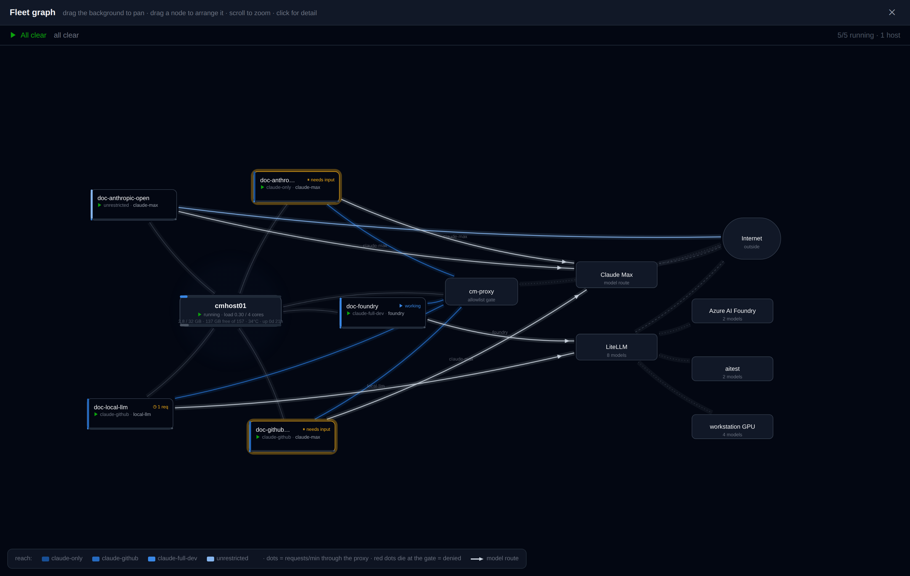
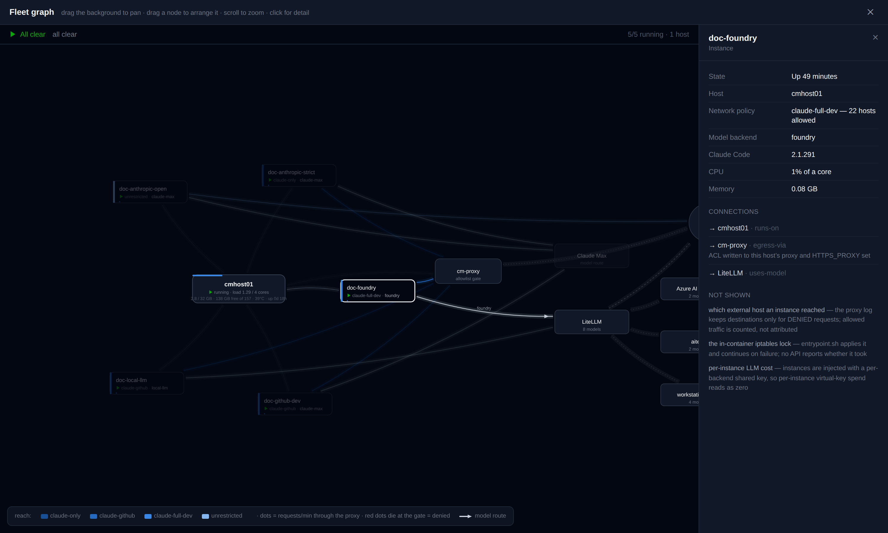
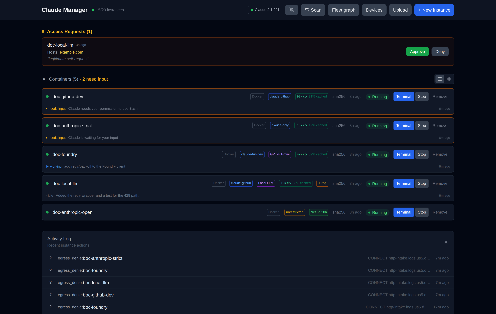
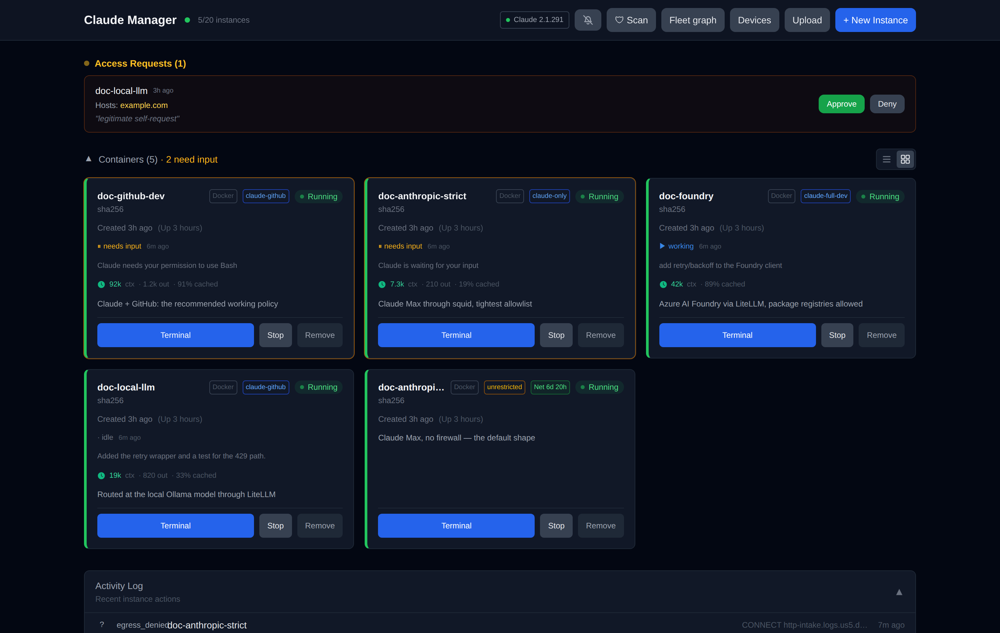
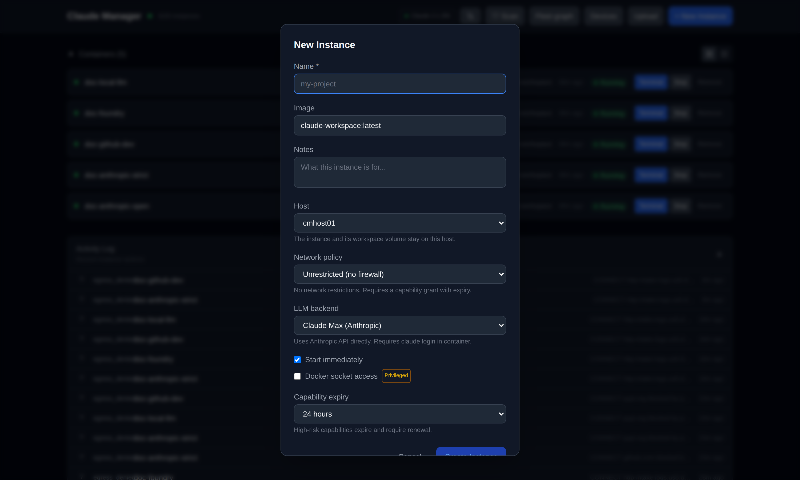
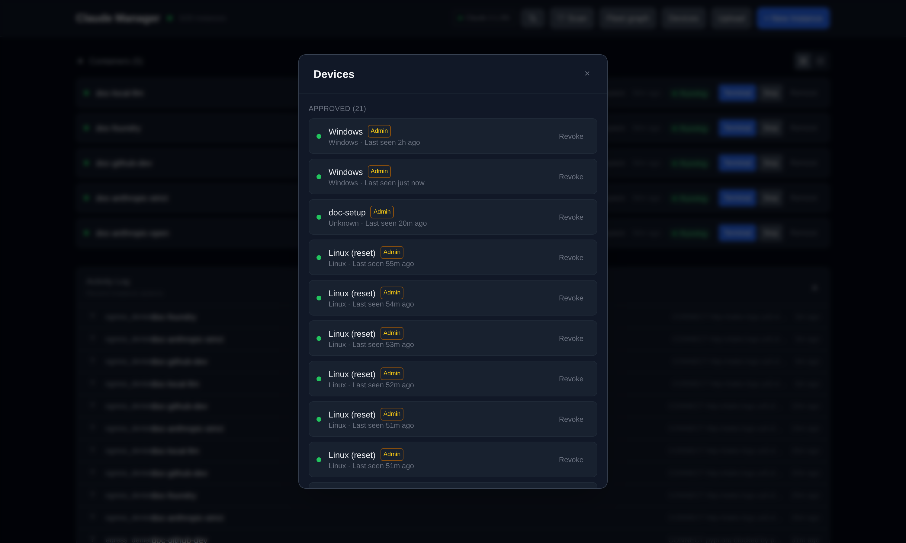
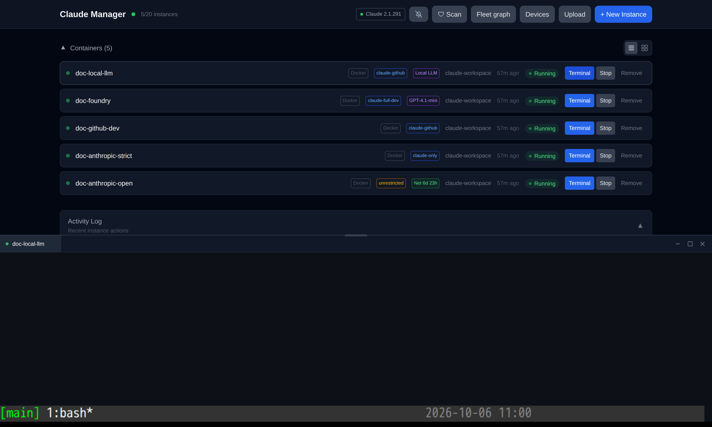
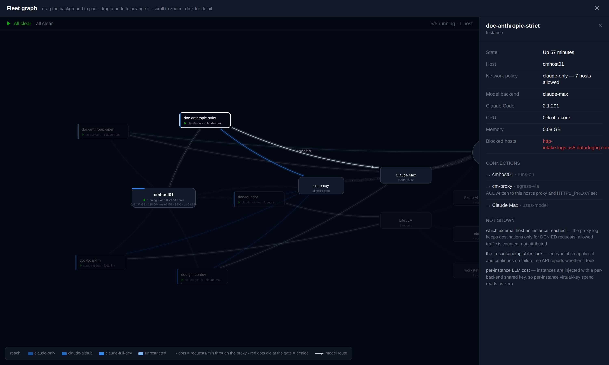
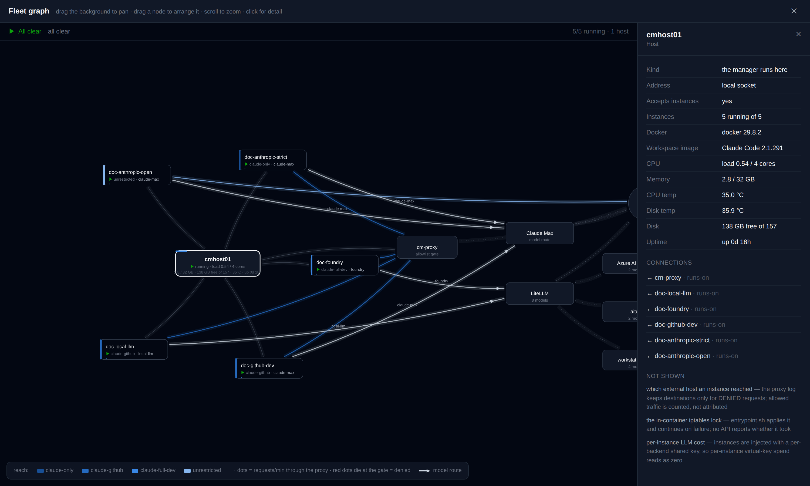

# The fleet graph

A map of the fleet: which host runs what, how each instance reaches the internet,
which model it talks to, and what is moving right now. Opened from **Fleet graph**
in the header — it is never the default view, because it is something you open to
look at rather than something you work in.

## What you are looking at

Each **host is a hub** with its instances ringed around it. The things they all
talk to sit on an outer arc: that host's **gate** (`cm-proxy`, the allowlist every
restricted instance passes through), the **model routes** (Claude Max direct, or
LiteLLM), the **providers** behind LiteLLM (Azure Foundry, the lab-gpu box, the
workstation GPU), and the **internet**.

**You can arrange it yourself.** Drag any node and it stays where you put it,
remembered in that browser; "reset layout" in the status bar goes back to the
computed positions. Drag the background to pan, scroll to zoom.

The layout is computed, never simulated: identical data gives identical
coordinates, so the ten-second refresh can't make anything jump under the pointer.

## What moves, and why

Only things that are actually moving.

- **White dots** are requests per minute through the proxy, counted from squid's
  access log. A quiet instance's link is still.
- **Red dots that die at the gate** are denied requests. They stop at the proxy
  because that is exactly what happened to them.
- **Model edges never animate.** The request count describes the
  instance → proxy → internet path; painting those same dots on a model edge would
  be animating a number that was never measured there.
- An **unrestricted** instance shows no dots at all. It does not pass through the
  proxy, so nothing counts its traffic — the absence is itself informative.

Selecting a node focuses it — only that node's path keeps its colour and its
flow, everything else recedes:

## Who is waiting on you

An instance's chip carries what its hook last reported. The three lifecycle
events are a state machine:

| Event | State | On the chip |
|---|---|---|
| `Notification` | waiting on a human | `⏸ needs input`, amber ring |
| `UserPromptSubmit` | you answered; Claude is working | `▶ working` |
| `Stop` | the turn finished | nothing |

`UserPromptSubmit` is the one that makes this honest. With only `Notification`
and `Stop`, a permission prompt you already answered in the terminal keeps
reading as "waiting" until the turn ends — which can be many minutes of a badge
that is simply wrong.

The ring is reinforcement, never the signal: the glyph and the word carry the
state, and `prefers-reduced-motion` stops the pulse.

## Load

Hosts show CPU (as `load1 / cores`), memory, and **temperature** — CPU package and
NVMe — scraped from that host's node-exporter. The thin bar across the top of a
tray is its CPU load.

Instances show CPU and memory from Docker stats for their container, with page
cache subtracted so the number is the workload rather than the file cache.

The drawer breaks the context window into **fresh input, cache read and cache
write** rather than one total. Cache reads are replayed at a fraction of the
input price and the cache is paid for once to write, so the ratio — not the
size — says whether a long session is cheap or thrashing. An instance last seen
by a hook that reported only a total shows `split: not reported` instead of a
0% cache rate it never measured.

## Colour

Colour is spent on exactly one question — **can this reach the internet** — because
a node-link graph is an all-pairs form, where any two marks can end up side by side,
and only three hues separate reliably under colour-vision deficiency on this dark
surface. Measured, not assumed.

So node *type* is carried by shape and position, and the blue ramp is ordinal:

| | Policy | Meaning |
|---|---|---|
| darkest | `claude-only` | 7 hosts allowed |
| | `claude-github` | 13 |
| | `claude-full-dev` | 22 |
| lightest | `unrestricted` | no firewall at all |

That ordering is legitimate because the allowlists genuinely nest — each is a
superset of the one before. Lightness is strictly monotone (OKLab L 0.433 → 0.764).
The darkest step sits at 2.48:1 on the background, below the 3:1 mark line, so it
always carries a visible text label; that is a requirement, not a preference.

**Status** keeps its own reserved colours and always ships a glyph *and* a word
(`▶ running`, `■ stopped`, `✕ unreachable`), so state is never carried by colour alone.

## Clicking things

Every node opens a drawer. An instance shows its policy with the allowlist size,
backend, Claude Code version, CPU, memory, traffic, grants and last scan. A host
shows its address, data root, capacity and temperatures. A gate explains its job.

The drawer also lists **connections with their evidence grade** — not just that an
edge exists, but how well the claim is backed:

- `enforced` — an ACL is written to this host's proxy and `HTTPS_PROXY` is set
- `open` — no firewall; this instance reaches whatever it likes
- `unenforceable` — **a restricted policy on a remote host.** `server/proxy.js`
  writes ACLs through a local-only Docker client and `HTTPS_PROXY` is a single
  global, so on any host the manager does not itself run on, the policy is a label
  with nothing behind it. The graph says so instead of drawing a gate that is not there.
- `broken` — health reports a missing or stale ACL

## What it does not know

The payload ships its own blind spots, and the drawer shows them, so a confident
picture is not mistaken for a complete one:

- **which external host an instance reached** — the proxy log keeps destinations
  only for denied requests; allowed traffic is counted, not attributed
- **the in-container iptables lock** — `entrypoint.sh` applies it and continues on
  failure; no API reports whether it took
- **per-instance LLM cost** — instances are injected with a per-backend shared key,
  so the per-instance virtual key's spend reads as zero
- **what Claude is doing between events** — the hook fires on three lifecycle
  events, so "working" means "you submitted a prompt and no Stop has arrived",
  not a live view of the turn

## The documentation fleet

The screenshots show five instances created to exercise every combination worth
seeing:

| Instance | Policy | Backend |
|---|---|---|
| `doc-anthropic-open` | unrestricted | Claude Max |
| `doc-anthropic-strict` | claude-only | Claude Max |
| `doc-github-dev` | claude-github | Claude Max |
| `doc-foundry` | claude-full-dev | Azure AI Foundry via LiteLLM |
| `doc-local-llm` | claude-github | local model via LiteLLM |

`doc-anthropic-strict` is the instructive one: curling github.com from it produces
denials, which is why its link carries red dots dying at the gate.

`doc-local-llm` routes at a **real model**: Ollama on the workstation's RTX 3090,
reached over the LAN and published through LiteLLM on host-a, which is why the
graph shows a "workstation GPU" provider behind the router.

## Every view

| | |
|---|---|
|  | The dashboard, list view |
|  | Grid view |
|  | New instance, with the host selector |
|  | Device approvals |
|  | The in-browser terminal |
|  | The fleet graph |
|  | An instance selected |
|  | A host selected |

## Implementation notes

- Layout is a **pure function** of the payload (`src/lib/graph-layout.js`), not a
  force simulation. The dashboard refetches on every Docker event; a solver would
  re-settle the graph under the pointer several times a second.
- Two layers: a canvas for links and particles, SVG above it for nodes, labels and
  hit targets. Canvas does not resolve CSS custom properties, so the tokens are
  resolved once with `getComputedStyle` — passing `var(--x)` to `strokeStyle`
  silently paints black.
- Pan captures the pointer **only once a drag exceeds 6px**. Capturing on
  pointerdown retargets the later click to the wrapper and makes every node
  unclickable.
- `prefers-reduced-motion` stops the particles; the links and all the information
  remain.
